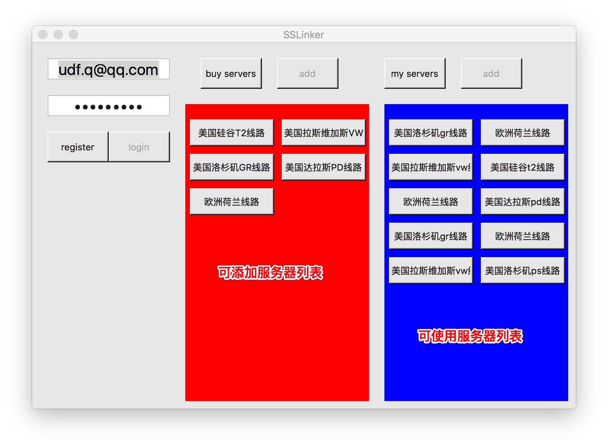

## SSLinker (一个简易的GFW解决方案)

* 自动获取Shadowsocks服务器
* 一键开启SS代理
* 完全免费

* Windows版本停止维护, 相关API可在 [sma11caseX](https://github.com/qokelate/sma11caseX) 获得.

## 使用说明
* 1. 点击 `register` 注册个用户(若已有账号则跳过)
* 2. 在App上登录您的账号
* 3. 在服务器列表中点击喜欢的地区,稍等片刻即可添加到账户服务器列表(若已有服务器,则跳过)
* 4. 在个人服务器列表中选中要开启的代理,默认为 `socks5://127.0.0.1:1080`
* 5. 在相应应用中设置代理,畅享无国界快感(在应用`Resource `目录有现成的`gfwlist.pac`,懒人可直接使用, `/SSLinker.app/Contents/Resources/Resources/gfwlist.js`)

## 关于
* 没什么好说的,`Released`目录是编译好的版本,不想折腾的下载解压即用.
* 致谢github!

